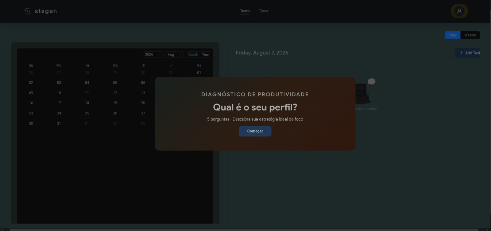
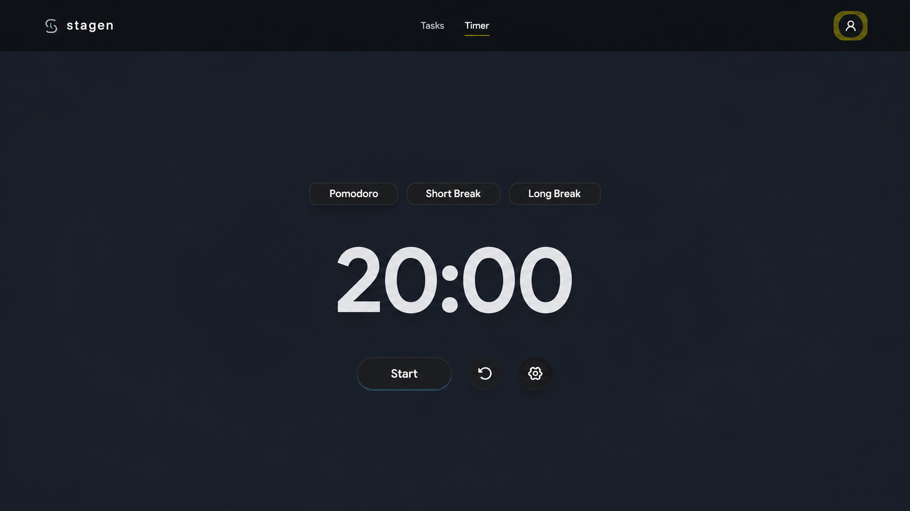

<h1 align="center">Stagen</h1>

<p align="center">
  Aplicativo de produtividade full-stack: site institucional público e um dashboard
  autenticado com calendário de tarefas e timer estilo Pomodoro.
</p>

<p align="center">
  
  
  
  
  
  
  
</p>

## Sobre

O Stagen é uma aplicação web de produtividade dividida em duas partes: um site
institucional público de apresentação e um painel autenticado onde o usuário
organiza tarefas em um calendário e usa um timer no estilo Pomodoro para
gerenciar o foco.

## Telas
 
<p align="center">
## Demo  

  
  <br/><br/>
  
  <br/><br/>
  
</p>

## Stack

**Front-end:** React 19, TypeScript, Vite, Ant Design
**Back-end:** Node.js, Express 5, TypeScript, MySQL

## Estrutura

```
stagen/
  frontend/   aplicação React + TypeScript (Vite)
  backend/    API em Node + Express + TypeScript, com MySQL
```

## Como rodar

Pré-requisitos: Node.js, npm e uma instância de MySQL.

```bash
sudo systemctl start mysql

# Back-end
cd backend
npm install
npm run dev

# Front-end (em outro terminal)
cd frontend
npm install
npm run dev
```

O front sobe em `http://localhost:5173/stagen/` e consome a API do back.

